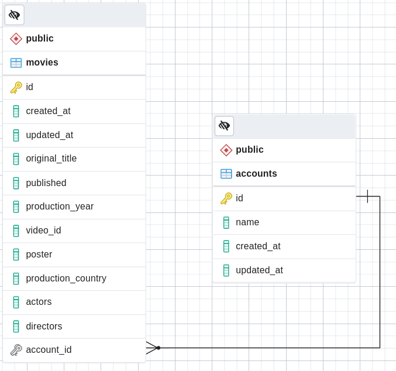

## Brightcove CRUD exercise


See live: [https://crud-app-production.up.railway.app](https://crud-app-production.up.railway.app/)

### Description

Specification: [Openapi](./openapi.yaml)

**Technologies**:

- **Framework**: NestJS (_express_)
- **ORM**: Prisma
- **Database**: Postgresql

**Structure**:

The main structure of the project is represented as follows:
```
├── src/
│   ├── app.controller.ts          /health /ready GET endpoints
│   ├── main.ts                    app entrypoint, filter/middleware configs
│   ├── movies/
│   │   ├── movies.controller.ts   /movies GET,POST,PUT,DELETE endpoints
│   │   ├── movies.dto.ts          Movie, MovieList, Pagination, etc...
│   │   ├── movies.schemas.ts      model validation schemas
│   │   └── movies.service.ts      validation & data access through prisma
│   └── utils/
│       ├── exception.filter.ts    HTTP response filter
│       ├── logger.middleware.ts   request logging middleware
│       ├── prisma.service.ts      prisma works as a repository layer
│       ├── exceptions.ts          service validation exceptions
│       └── config.ts              env variables loading & validation
├── prisma/
│   ├── schema.prisma              database schema
│   ├── seed.ts                    populate scripts
│   └── migrations/                databse schema migration scripts
└── test/                          e2e tests
```

**Database schema**:



### Developing

Environment variables (.env file supported)
```
ENV=dev
PORT=3000
DATABASE_URL=postgres://user:password@db:5432/postgres
```

Accessing localhost:PORT will redirect to */docs*.

To view *openapi* generated specs go to */docs-api*

Startup by running:
```
npm run start:dev
```

Or start services and application with **docker** and **docker-compose**
```
docker-compose up
```

- The application will run in development mode on a node image
- Changes made in the source code triggers a refresh.

Two services are started:
- *Postgresql service*: user=user, password=password
- *PgAdmin dashboard*: mail=user@brightcove.com, password=password

Besides the PgAdmin dashboard, **prisma** provides an ui to manipulate the
database:
```
npx prisma studio
```

**Migrations & seeding**
```
npx prisma migrate --name foo       # generate a migration
npx prisma generate                 # generate model client and types
npx prisma db seed                  # insert data
```

### Building

Build service:
```
npm run build
```

Or build docker image
```
docker build . -t brightcove-crud:1.0.0
```
